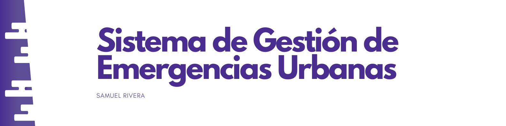

<h1 align="center">RETO 02 - Sistema de gestión de Emergencias Urbanas</h1>

</img>

<details>
  <summary>Tabla de Contenidos:</summary>
  <ol>
    <li><a href="#about">Sobre el proyecto</a></li>
    <li><a href="#objectives">Objetivos</a></li>
    <li><a href="#sistemflow">Flujo del Sistema</a></li>
    <li><a href="#usage">Uso</a></li>
    <li><a href="#gallery">Galeria</a></li>
    <li><a href="#code">Código</a></li>
    <li><a href="#contact">Contacto</a></li>
  </ol>
</details>

<!-- Sobre -->
<h2 id="about">Sobre el proyecto 🚨</h2>
<h3>Introducción:</h3>
<p>Desarrollo de aplicación por consola que facilita la coordinación de servicios de emergencia en una ciudad, incluyendo bomberos, ambulancia y policía.</p>

<p>Puedes encontrar el video <a href="#">aqui mismo 🎥.</a></p>


<h3 align="left">Lenguajes y herramientas:</h3>

<p align="left">
  <a href="https://skillicons.dev">
    
  </a>
</p>

<!-- Objetivos -->
<h2 id="objectives">Funciones Principales 🎯</h2>

<p>El objetivo principal es crear un programa usando los conceptos aprendidos de POO (Programación Orientada a Objetos), que permita gestionar diferentes tipos de emergencias, asignar recursos según prioridad y evaluar el rendimiento del sistema. Con el ejercio se practican habilidades intermedias de diseño, programación y resolución de problemas en sistemas críticos.</p>

<h3>Objetivos:</h3>

<ol>
<li><strong>Modelar el Sistema de Emergencias</strong></li>
<p>Crear clases para los servicios de emergencia (Departamento de Bomberos, Ambulancia, Policia). Cada una con atributos y métodos específicos.</p>
<p>Definir una clase principal "Emergencia" que almacene información como tipo, ubicación, nivel de gravedad y tiempo de respuesta.</p>

<li><strong>Aplicar Encapsulamiento y Herencia</strong></li>
<p>Diseñar una jerarquía de clases para diferentes tipos de emergencias (incendio, Accidente Vehicular, Robo).</p>
<p>Proteger datos sensibles como ubicaciones críticas o identidades mediante modificadores de acceso.</p>

<li><strong>Usar Polimorfismo e Interfaces</strong></li>
<p>Crear una interfaz "Responder" con métodos como "atenderEmergencia" y "evaluarEstado".</p>
<p>Implementar la interfaz en los servicios de emergencia y personalizar su comportamiento según el tipo de emergencia.</p>

<li><strong>Incorporar Patrones de Diseño Básicos.</strong></li>
<p>Utilizar el patrón "Factory" para crear instancias de emergencias según su tipo.</p>
<p>Aplicar el patrón "Singleton" para centralizar la gestión de recursos disponiblen en un único controlador del sistema.</p>

<li><strong>Implementar Estrategias Avanzadas</strong></li>
<p>Usar el patrón "Strategy" para definir cómo se priorizan las emergencias (por ejemplo, gravedad alta vs. cercanía a la base de operaciones).</p>
<p>Implementar el patrón "Observer" para notificar automáticamente a los servicios relevantos cuando ocurre una nueva emergencia.</p>

<li><strong>Integrar Clases Internas y Lambda</strong></li>
<p>Implementar clases internas para modelar mapas urbanos, permitiendo verificar la proximidad de los recursos a las emergencias.</p>
<p>Usar expresiones lambda para filtrar listas de recursos disponibles según criterios específicos (distancia, tiempo de respuesta).</p>

<li><strong>Evaluar y Optimizar el Sistema</strong></li>
<p>Calcular métricas de desempeño, como el tiempo promedio de respuesta, emergencias atendidas y recursos disponibles al final de cada jornada.</p>
<p>Evaluar la eficacia de las decisiones tomadas, optimizando la asignación de recursos según los resultados.</p>
</ol>

<h3>Requerimientos funcionales:</h3>

<ol>
<li><strong>Registro de Emergencias</strong></li>
<p>Presentar un menú con diferentes tipos de emergencias</p>
<p>Solicitar detalles específicos sobre la emergencia, como su ubicación, nivel de gravedad (bajo, medio, alto) y tiempo estimado de atención inicial.</p>
<p>Mostrar un resumen del incidente y confirmar el registro.</p>

<li><strong>Asignación de Recursos</strong></li>
<p>Consultar la disponibilidad de recursos de emergencia basados en la ubicación y tipo de emergencia.</p>
<p>Calcular los recursos necesarios según la gravedad del evento</p>
<p>Permitir al usuario confirmar o ajustar la asignación de recursos antes de enviarlos.</p>

<li><strong>Gestión de Recursos</strong></li>
<p>Mostrar el estado actual de los recursos, como vehículos disponibles, personal activo y combustible restante.</p>
<p>Permitir al usuario reasignar recursos entre emergencias si se agotan o si se presentan situaciones inesperadas.</p>

<li><strong>Monitoreo del Estado de las Emergencias</strong></li>
<p>Mostrar el progreso de atención de cada emergencia en tiempo real (%)</p>
<p>Indicar si alguna emergencia no fue atendida a tiempo o si se resolvió con éxito.</p>
<p>Proporcionar un resumen al final de la jornada, incluyendo emergencias atendidas, recursos gastados, y tiempo promedio de respuesta.</p>

<li><strong>Interacción con el Usuario</strong></li>
<p>El sistema debe ogrecer un menú interactivo con opciones claras: Registrar una nueva emergencia, ver el estado actual de los recursos, atender una emergencia, y terminar la jornada.</p>
<p>Validar la entrada del usuario para evitar errores</p>

<li><strong>Estadísticas y Evaluación de Desempeño</strong></li>
<p>Calcular y mostrar métricas al final de la jornada, como:</p>
    <ul>
        <li>Cantidad de emergencias atendidas.</li>
        <li>Tiempo promedio de respuesta por tipo de emergencia.</li>
        <li>Recursos gastados vs. recursos disponibles</li>
    </ul>
<p>Permitir al usuario analizar los resultados para planificar mejor futuras jornadas.</p>
</ol>

<h2 id="sistemflow">Desacripción del Flujo del Sistema 💻</h3>

<p>El flujo del sistema de gestión de emergencias urbanas está diseñado para permitir una gestión eficiente y clara de las emergencias en una ciudad. El sistema sigue un ciclo continuo que permite registrar emergencias, asignar recursos, monitorizar el progreso de las atenciones y evaluar el rendimiento del sistema. Acontinucación, se describe el flujo general del sistema.</p>

<ol>
    <li>Inicio del Sistema</li>
    <p>El sistema comienza con una configuración inicial en la que se asignan los recursos disponibles, como vehículos, personal y otros elementos necesario para la atención de emergencias. Esta fase garantiza que el sistema tenga toda la información requerida para operar.</p>
    <li>Menú de Opciones</li>
    <p>Una vez iniciado el sistema, el usuario se enfrenta a un menú interactivo que le permite seleccionar entre diversas opciones:</p>
    <ul>
        <li>Registrar una nueva emergencia: El usuario puede ingresar información sobre la emergencia, como el tipo (incendio, accidente vehicular, robe, etc.), la ubicación y el nivel gravedad.</li>
        <li>Ver el estado de los recursos disponibles: El sistema muestra el estado actual de los recursos, tales como vehículos, personal y combustible disponible.</li>
        <li>Atender una emergencia: El usuario puede asignar recursos a una emergencia específica basándose en la prioridad determinada por la gravedad del evento y su proximidad.</li>
        <li>Mostrar estadísticas: Al finalizar la jornada o cuando se desee evaluar el desempeño del sistema, el usuario puede ver métricas clave, como el número de emergencias atendidas, tiempo promedio de respuesta , y recursos utilizados.</li>
    </ul>
    <li>Registro y Asignación de Emergencias</li>
    <p>Cuando se registra una nueva emergencia, el sistema solicita al usuario los detalles sobre el incidente y calcula automáticamente los recursos necesarios para atenderlo, según la gravedad y el tipo de emergencia.</p>
    <p>El usuario puede ajustar la asignación de recursos antes de confirmar el envio.</p>
    <li>Gestión de Recursos</li>
    <p>El sistema monitorea constantemente el estado de los recursos. Si los recursos se agotan o se requieren máx unidades, el sistema ofrece la opción de reasignar recursos entre emergencias.</p>
    <p>Los recursos son consumidos a medida que se utilizan, por lo que el sistema también simula la progresiva disminución de la disponibilidad a lo largo del día.</p>
    <li>Monitoreo de Emergencias</li>
    <p>A lo largo del día, el sistema muestra el progreso de las emergencias en tiempo real, indicándole al usuario el porcentaje de resolución de cada incidente.</p>
    <p>El sistema también avisa cuando una emergencia no se atiende dentro del tiempo esperado, o si se resuelve exitosamente.</p>
    <li>Evaluación del Desempeño del Sistema</li>
    <p>Al final de ciclo de trabajo o jornada, el sistema ofrece un resumen de las emergencias atendidas, los recursos gastados, y el tiempo promedio de respuesta.</p>
    <p>Las métricas son generadas y mostradas al usuario para su análisis y reflexión. El sistema permite comparar los recursos gastados versus los disponibles, ofreciendo una visión clara de la eficiencia operativa del sistema.</p>
    <li>Cierre del Sistema</li>
    <p>Una vez finalizada la jornada, el sistema guarda un registro de las operaciones realizadas, que incluye las estadísticas y cualquier detalle relevante sobre las emergencias atendidas.</p>
    <p>El sistema se prepara para el siguiente ciclo, garantizando que los datos y recursos estén listos para ser utilizados nuevamente.</p>
</ol>

<!-- USO -->
<h2 id="usage">Uso 🚀</h2>
<h3>Ejecutar el programa</h3>
<p text-align="justify">Para ejecutar este programa es necesario tener el JDK 21 de Java. Este se puede descargar desde el sitio de <a href="https://www.oracle.com/java/technologies/downloads/">Oracle</a></p>

<p>Instrucciones para configurar el proyecto localmente:</p>

<h3>Prerequisitos:</h3>
<ul>
  <li>IDE (IntelliJ, Eclipse, NetBeans, VSCode, etc).</li>
  <li>JDK > 21 <a href="https://www.oracle.com/java/technologies/downloads/">Download JDK</a></li>
</ul>

<h3>Instalación:</h3>

<p>
  <strong>Nota:</strong> Este es un proyecto de uso estudiantil, no debe utilizarse para uso comercial.
</p>

```shell
# Clona el repositorio
git clone https://github.com/dnbsammie/Reto02.git
cd Reto02-clone

# Ejecuta el projecto
javac Emergency.java

java Emergency
```

<!-- GALERIA -->
<h2 id="gallery">Galería 🖼</h2>
<p align="center">
  
  
  
</p>
<p align="center">
  <strong>Fig. 1:</strong> Imágenes de ejemplo del proyecto.
</p>

<!-- CÓDIGO -->
<h2 id="gallery">Código 👨‍💻</h2>
<h3>Main (Emergency): </h3>

```java
package main;

import java.util.Scanner;

public class Emergency {
    public static void main(String[] args) {
        Scanner input = new Scanner(System.in);
        input.close();
    }
}
```

<!-- CONTACTO -->
<h2 id="contact">Contacto 📧</h2>
<p>
  <strong>Autor:</strong> Samuel Rivera<br>
  <strong>GitHub:</strong> <a href="https://github.com/dnbsammie">https://github.com/dnbsammie</a>
</p>
